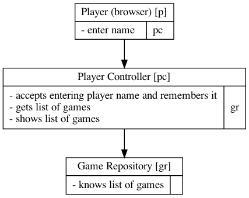

# CRCDiagram

<!-- TOC -->

- [CRCDiagram](#crcdiagram)
  - [Introduction](#introduction)
  - [CRC Diagram File Format](#crc-diagram-file-format)
  - [Installing](#installing)
    - [Jar file](#jar-file)
    - [Native executable](#native-executable)
  - [Converting diagram to picture](#converting-diagram-to-picture)

<!-- /TOC -->

## Introduction

This is command line tool that converts file with CRC cards (CRC Diagram) to figure in png or s svg.

CRC (Class Responsibility Collaboration) Card is a brainstorming tool used in the design of object-oriented software. There is article ["A Laboratory For Teaching Object-Oriented Thinking" by Kent Beck and Ward Cunningham](http://c2.com/doc/oopsla89/paper.html) that explains basics.

Diagrams in this tool are extended with aliases for each class name and with arrows that represents collaborators.

Current version is `0.2.0`.

## CRC Diagram File Format

The file is composed from a set of classes. Each class is in following format:

```
class name {
...
}
```

If the class name needs to have spaces and special characters then you need to put it in double quotes like this: `"class name with spaces"`.

If the name is long then it is not practical to use it as collaborator. That is why you can have alias it is written like this: `"class name with spaces" as cn` where the alias is `cn`.

In the body of class is list of responsibilities and collaborators for each responsibility. The minimum is to have just responsibility. They are divided by `:` e.g.

```
responsibility 1 without collaborator
responsibility 2 : collaborator 1
```

The responsibility one don't have collaborator but responsibility 2 has

Here is complete example with 3 classes:

```
class "Player (browser)" as p {
  enter name : pc
}

class "Player Controller" as pc {
  accepts entering player name and remembers it
  gets list of games : gr
  shows list of games
}

class "Game Repository" as gr {
  knows list of games
}
```

Here is generated picture:



## Installing

In order to use this tool you need to install [Graphviz tool](https://graphviz.org) because it CRC Diagram is converting CRC File format to DOT format and runs it to convert it to png or svg. Graphviz can be on path or you can specify location as command line argument.

After installing Graphviz you can download source of CRCDiagram and compile it in jar file or to executable file by using Graal. You need to have installed and configured Java 11+.

### Jar file

Compiling:

```sh
./gradlew fatJar
```

It generates `build/libs/CrcDiagram-all-0.1.0.jar`.

### Native executable

Compiling:

```sh
./gradlew nativeImage
```

It generates `build/graal/crcDiagram`. You can put crcDiagram in path.

## Converting diagram to picture

Converting diagram is running either jar file or executable. You can get help in running tool by setting argument `-h`.

The options are:

```
usage: crcDiagram [OPTIONS]
 -d                debug
 -dotPath <path>   path to dot command
 -f <format>       image format - png (default) or svg
 -h                help
 -i <file>         input file in CRC format
 -o <file>         output file - generated image
 -v                version

Typical usage: crcDiagram -i input_file -f png -o output_file
If dot can not be found add parameter with path to it
e.g. "-dotPath /usr/local/bin"
```

Running with jar file:

```sh
java -jar build/libs/CrcDiagram-all-0.1.0.jar -i doc/game.crc -o doc/game.png -f png
```

Running with native executable:

```sh
./build/graal/crcDiagram -i doc/game.crc -o doc/game.png -f png
```
